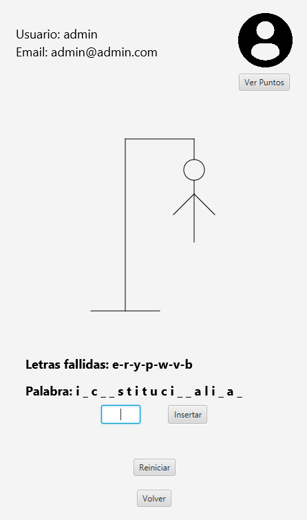

# Juego del Ahorcado 🎮

## 📝 Descripción
Una implementación del clásico juego del ahorcado desarrollada en Java con JavaFX, donde los jugadores deben adivinar palabras letra por letra antes de que el muñeco sea completamente dibujado.

## 🎯 Características Principales

### 👤 Sistema de Usuarios
* Registro de nuevos usuarios
* Inicio de sesión seguro
* Recuperación de contraseña
* Perfil de usuario personalizable

### 🎲 Mecánicas de Juego
* 3 niveles de dificultad:
  * 😊 Fácil
  * 😐 Medio
  * 😨 Difícil
* Sistema de progresión basado en victorias
* Palabras aleatorias por nivel
* Interfaz gráfica intuitiva
* 9 intentos máximos

### 📊 Sistema de Estadísticas
* Registro de victorias/derrotas
* Seguimiento de rachas
* Nivel actual y progreso
* Almacenamiento persistente en base de datos

## 🛠️ Tecnologías Utilizadas
* 
* 
* 
* 

## 🎮 Interfaz del Juego


## 📁 Estructura del Proyecto
```
juegoAhorcado/
├── src/
│   ├── main/
│   │   ├── java/
│   │   │   └── es/ies/puerto/
│   │   │       ├── controller/    # Controladores JavaFX
│   │   │       ├── model/        # Entidades y lógica
│   │   │       └── config/       # Configuraciones
│   │   └── resources/
│   │       ├── images/          # Recursos gráficos
│   │       └── es/ies/puerto/   # Archivos FXML
└── pom.xml                     # Configuración Maven
```

## 🌍 Idiomas Disponibles
* 🇪🇸 Español
* 🇬🇧 Inglés (En desarrollo)
* 🇫🇷 Francés (En desarrollo)

## 💾 Base de Datos
Sistema SQLite que almacena:
* Información de usuarios
* Banco de palabras por nivel
* Estadísticas de juego

## ✍️ Autor
* [Álvaro García López](https://github.com/alvarogrlp)

---
⭐ Si te gusta este proyecto, ¡no dudes en darle una estrella!
